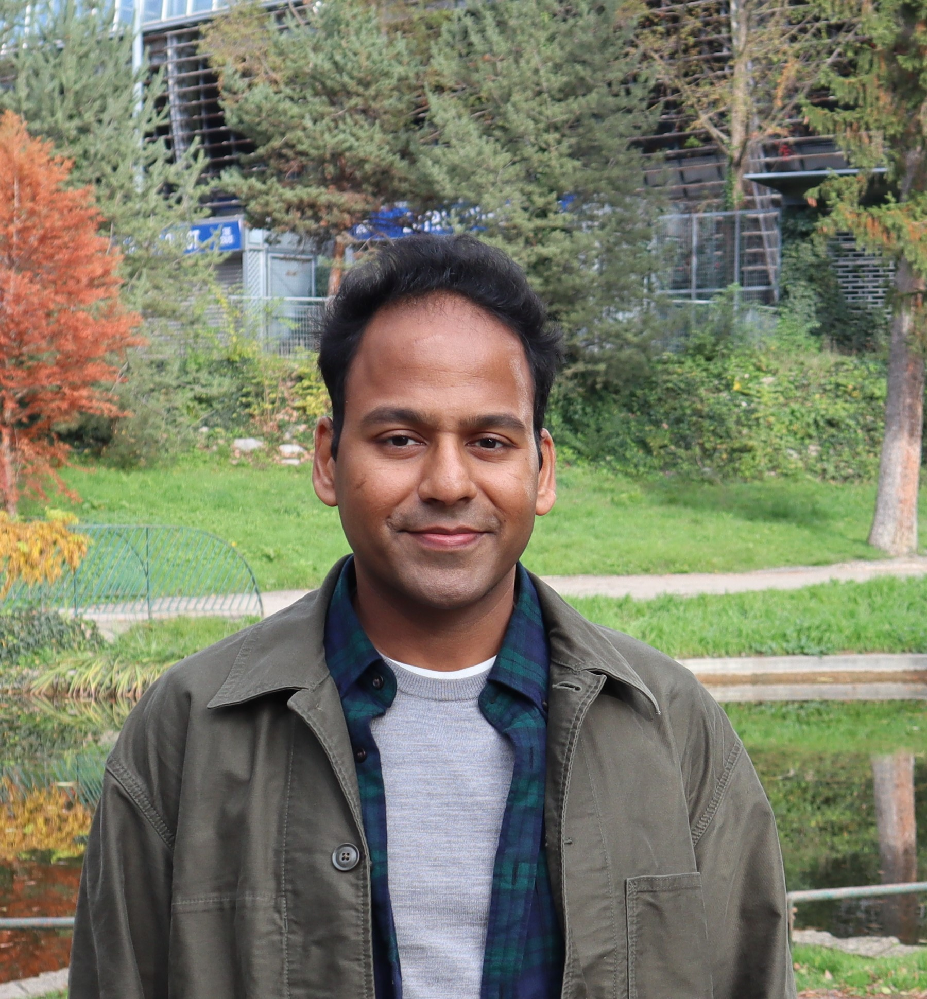

{width=30%}  

I am an Assistant Professor in the Computer Science and Artificial Intelligence division of Plaksha University, where I teach courses on Operating Systems and ML Systems. My research interests lie in improving reasoning abilities of LLMs and on speeding up inference and training of LLMs.

I completed my PhD under Dr. Pawan Mudigonda in the OVAL group at University of Oxford, where I worked on optimization problems arising in machine learning. Post-PhD, I was a Research Scientist at Naver Labs Europe in Grenoble, France. I also worked as Data Analyst at General Electric in Bangalore, India. I completed my undergraduate studies at the Indian Institute of Technology, Kharagpur.
    
**Email**: pankaj dot pansari at plaksha.edu.in 