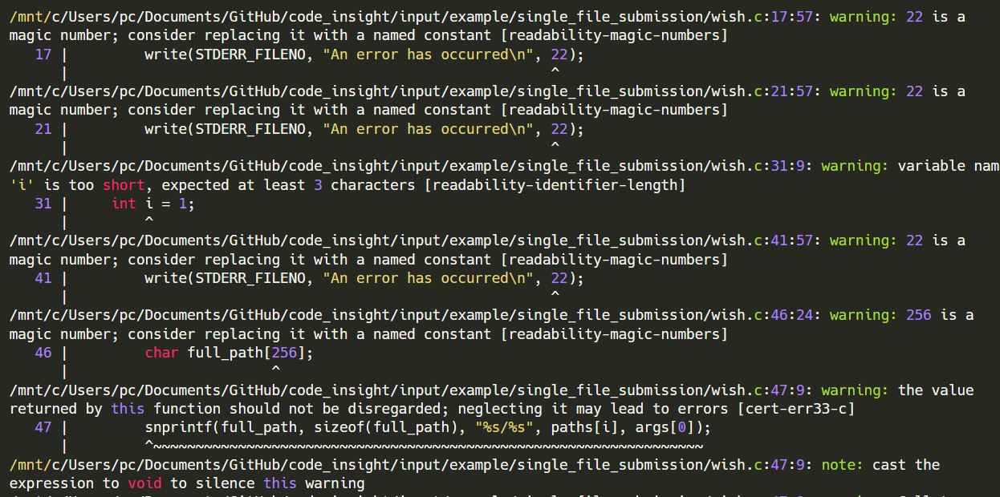
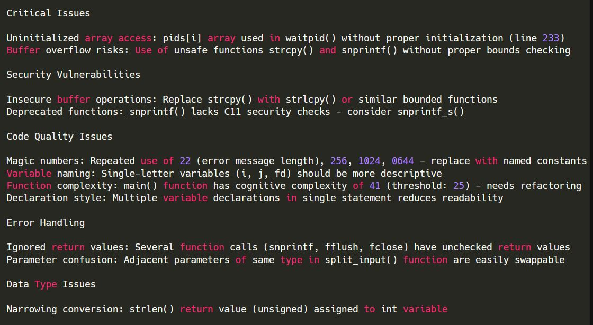

GitHub repo: [https://github.com/pankajpansari/code-critique](https://github.com/pankajpansari/code-critique)

### Motivation

Programming assignments are first and foremost tested for correctness,
usually by a suite of test cases. It's also a good opportunity to give
feedback to students on the quality of their implementation. Good code
should be readable, follow language convention, have good design, make
judicious use of data structures, and manage memory properly (for C
programs). It's not often easy to give such feedback individually to all
students due to time and resource constraints. Hence, I wrote
**code-critique** for my own use-case. The students found the feedback
from the tool helpful and I thought it may be of use to the broader CS
teaching community.

**code-critique** is a command-line tool that makes use of LLMs in a
specific pipeline, working with code diffs and using linter tool, to
annotate the original submission with feedback inserted as comments at
appropriate points. It works really well when the assignment involves
making addition/modifications to an existing repository, for example
implementing a system call in an educational OS (like xv6).



### Why not just use a linter?

Both **code-critique** and linter are static code-analysis tool. Linters
check for adhere to language convention and also flag possible bugs or
security issues, so it addresses part of our aim. However, linters are
rule-based and struggle with pointing out issues in design of program
and whether descriptive comments and names are being used. The biggest
issue is that linters don't take into account the problem statement into
consideration. This is not to say that linters cannot help us; in fact,
we integrate `clang-tidy` output in our pipeline.

### Design Choices

-   **Reflection** - We ask an LLM model to give feedback on code
    submission in context of problem statement and what we consider good
    programming practices. We're likely to obtain better results if we
    ask the LLM to go through its response and refine or correct it. We
    assign the role of *Proposer* to the first LLM call and *Reviewer*
    to the second LLM.

-   **Linter integration** - We run `clang-tidy` linter on our C program
    submission (you can use a suitable linter for your language). To
    prevent issue repetitions and lengthy pathnames from confusing the
    *Reviewer* LLM, we obtain a compact summary of linter output via an
    LLM that we term *Summarizer*. We leave it to *Reviewer* to
    formulate proper corresponding comment annotations and situate them
    via line numbers.

::: {layout-ncol=2}
{width=120%}

{width=120%}
:::

In my implementation, I did not use linter for repo submission since I
evaluated assignments on `xv6` OS codebase. Kernel code is not very
amenable to linter analysis due to particular programming conventions.

-   **Structured output** - It's easier for us if both *Proposer* and
    *Reviewer* give us their output as a list of feedback annotations,
    where each item of list has two components - line number where the
    comment should go, and the actual comment. It's more compact. It's
    also helpful because we can take in the *Reviewer* structured output
    and treat it like comment diffs - we take the original code and
    simply add in the comments at the respective line numbers. This way,
    we don't modify the original implementation.


**LLM model selection** - I used `o4-mini` as *Proposer* and *Reviewer*
LLMs and `gpt-4.1` as *Summarizer*. I'd recommend using a decent
reasoning model (doesn't have to be the most expensive) as
*Proposer*-*Reviewer*, and a very good non-reasoning model as
*Summarizer*. I used OpenAI API, but structured output is also supported
by Gemini API; you can use Gemini models as well. The API syntax for
Gemini is a wee different.

### Output

**Single-file submission**: In this case, we want one output program
file where the code is exactly as in the original submission. Feedback
annotations are inserted at appropriate points, and start with
`REVIEW:`. At the end, we have a `Summary` - this makes it easier to
give feedback on global high-level design and also avoids cluttering the
code section with feedback for repetitive issue.

``` {.c style="max-height: 400px; overflow-y: auto;"}
#include <stdio.h>
#include <stdlib.h>
#include <string.h>
#include <unistd.h>
#include <sys/wait.h>
#include <fcntl.h>

#define MAX_ARGS 64       // Max arguments per command
#define MAX_PATHS 64      // Max paths in search path
#define MAX_COMMANDS 64   // Max parallel commands


/* 
 * REVIEW: `paths` and `path_count` are declared as globals, which increases coupling and 
 * hinders testing. Consider encapsulating shell state in a struct passed to 
 * functions, or at minimum mark these variables `static` to limit their linkage.
 */
char *paths[MAX_PATHS];
int path_count = 0;

void change_directory(char **args) {
    if (args[1] == NULL || args[2] != NULL) {

/* 
 * REVIEW: The literal length `22` is repeated in each `write` call for the error message. 
 * Define a single `const char error_message[] = "An error has occurred\n";` and 
 * use `sizeof error_message` to avoid mismatches and improve maintainability.
 */
        write(STDERR_FILENO, "An error has occurred\n", 22);
        return;
    }
    if (chdir(args[1]) != 0) {
        write(STDERR_FILENO, "An error has occurred\n", 22);
    }
}

void update_path(char **args) {
    for (int i = 0; i < path_count; i++) {
        free(paths[i]);
    }
    path_count = 0;

    int i = 1;
    while (args[i] != NULL && path_count < MAX_PATHS) {
        paths[path_count] = strdup(args[i]);
        path_count++;
        i++;
    }
}

int run_command(char **args) {
    if (path_count == 0) {
        write(STDERR_FILENO, "An error has occurred\n", 22);
        return -1;
    }

    for (int i = 0; i < path_count; i++) {

/* 
 * REVIEW: Using a fixed 256-byte buffer for `full_path` can overflow if the directory plus 
 * command name exceeds this length. Consider using `PATH_MAX` or dynamically 
 * allocating exactly the needed size.
 */
        char full_path[256];
        snprintf(full_path, sizeof(full_path), "%s/%s", paths[i], args[0]);

        if (access(full_path, X_OK) == 0) {
            execv(full_path, args);
            return -1;
        }
    }

    write(STDERR_FILENO, "An error has occurred\n", 22);
    return -1;
}

void clean_input(char *input) {

/* 
 * REVIEW: The local buffer `cleaned[1024]` can overflow if `input` exceeds 1023 
 * characters. Since `getline` may return arbitrarily long lines, either 
 * dynamically size `cleaned` or enforce a bounds check before writing into it.
 */
    char cleaned[1024];
    int i = 0, j = 0;

/* 
 * REVIEW: You assign `strlen(input)` (a `size_t`) to an `int len`. This narrowing 
 * conversion can overflow on large inputs. Use `size_t` for `len` to match the 
 * return type of `strlen`.
 */
    int len = strlen(input);

    while (i < len) {
        if (input[i] == '>' || input[i] == '&') {
            if (j > 0 && cleaned[j - 1] != ' ') {
                cleaned[j++] = ' ';
            }
            cleaned[j++] = input[i];
            if (i + 1 < len && input[i + 1] != ' ') {
                cleaned[j++] = ' ';
            }
        } else {
            cleaned[j++] = input[i];
        }
        i++;
    }
    cleaned[j] = '\0';

/* 
 * REVIEW: `strcpy(input, cleaned)` is unbounded and risks buffer overflows. Use a bounded 
 * copy such as `strlcpy` (if available) or `snprintf` to ensure you don’t exceed 
 * `input`’s allocated size.
 */
    strcpy(input, cleaned);
}

int split_input(char *input, char **args, char **output_file) {
    int argc = 0;
    char *token;
    int redirect_found = 0;
    int no_more_args = 0;

    clean_input(input);


/* 
 * REVIEW: `strsep(&input, ...)` modifies the `input` pointer itself, which can make later 
 * debugging harder and might surprise readers. Consider working on a duplicate 
 * pointer or using `strtok_r` if you need to preserve the original buffer.
 */
    while ((token = strsep(&input, " \t\n")) != NULL) {
        if (strlen(token) == 0) {
            continue;
        }

        if (no_more_args) {
            write(STDERR_FILENO, "An error has occurred\n", 22);
            return -1;
        }

        if (strcmp(token, ">") == 0) {
            if (redirect_found || argc == 0) {
                write(STDERR_FILENO, "An error has occurred\n", 22);
                return -1;
            }
            redirect_found = 1;
        } else if (redirect_found) {
            *output_file = token;
            redirect_found = 0;
            no_more_args = 1;
        } else {
            args[argc++] = token;
        }
    }

    if (redirect_found) {
        write(STDERR_FILENO, "An error has occurred\n", 22);
        return -1;
    }

    args[argc] = NULL;
    return argc;
}

void execute_command(char *command) {
    char *args[MAX_ARGS];
    char *output_file = NULL;

    int argc = split_input(command, args, &output_file);

    if (argc == -1 || argc == 0) {
        return;
    }

    if (strcmp(args[0], "exit") == 0) {
        if (argc > 1) {
            write(STDERR_FILENO, "An error has occurred\n", 22);
        } else {
            exit(0);
        }
    } else if (strcmp(args[0], "cd") == 0) {
        change_directory(args);
    } else if (strcmp(args[0], "path") == 0) {
        update_path(args);
    } else {
        pid_t pid = fork();
        if (pid == 0) {
            if (output_file != NULL) {

/* 
 * REVIEW: The file-creation mode `0644` is a magic constant. Define a macro or constant 
 * like `#define OUTPUT_MODE 0644` to document its meaning and avoid repetition.
 */
                int fd = open(output_file, O_WRONLY | O_CREAT | O_TRUNC, 0644);
                if (fd < 0) {
                    write(STDERR_FILENO, "An error has occurred\n", 22);
                    exit(1);
                }
                dup2(fd, STDOUT_FILENO);
                dup2(fd, STDERR_FILENO);
                close(fd);
            }
            if (run_command(args) == -1) {
                exit(1);
            }
        } else if (pid > 0) {
            wait(NULL);
        } else {
            write(STDERR_FILENO, "An error has occurred\n", 22);
        }
    }
}


/* 
 * REVIEW: `main` handles initialization, the prompt loop, parsing, execution, and cleanup, 
 * giving it high cognitive complexity. Break it into smaller functions (e.g., 
 * `run_interactive()`, `run_batch()`, `cleanup()`) to improve readability and 
 * testability.
 */
int main(int argc, char **argv) {
    char *line = NULL;
    size_t len = 0;
    ssize_t read;
    FILE *input_file = stdin;

    paths[path_count++] = strdup("/bin");

    if (argc == 2) {
        input_file = fopen(argv[1], "r");
        if (input_file == NULL) {
            write(STDERR_FILENO, "An error has occurred\n", 22);
            exit(1);
        }
    } else if (argc > 2) {
        write(STDERR_FILENO, "An error has occurred\n", 22);
        exit(1);
    }

    while (1) {
        char *commands[MAX_COMMANDS];
        int command_count = 0;

        if (input_file == stdin) {
            printf("wish> ");
            fflush(stdout);
        }

        read = getline(&line, &len, input_file);
        if (read == -1) {
            break;
        }

        clean_input(line);

        int contains_ampersand = 0;
        for (int i = 0; line[i] != '\0'; i++) {
            if (line[i] == '&') {
                contains_ampersand = 1;
                break;
            }
        }

        if (contains_ampersand) {
            char *token;
            while ((token = strsep(&line, "&")) != NULL) {
                if (strlen(token) > 0) {
                    commands[command_count++] = strdup(token);
                }
            }

            pid_t pids[MAX_COMMANDS];
            for (int i = 0; i < command_count; i++) {
                pid_t pid = fork();
                if (pid == 0) {
                    execute_command(commands[i]);
                    exit(0);
                } else if (pid > 0) {
                    pids[i] = pid;
                } else {
                    write(STDERR_FILENO, "An error has occurred\n", 22);
                }
            }

            for (int i = 0; i < command_count; i++) {
                waitpid(pids[i], NULL, 0);
            }

            for (int i = 0; i < command_count; i++) {
                free(commands[i]);
            }
        } else {
            execute_command(line);
        }
    }

    for (int i = 0; i < path_count; i++) {
        free(paths[i]);
    }
    if (input_file != stdin) {
        fclose(input_file);
    }
    free(line);
    return 0;
}

/*
 *
 * STRENGTHS: 
 *The implementation cleanly separates built-in commands (`exit`, `cd`, `path`), 
 * parsing, and execution; correctly uses `fork`/`execv`; handles I/O redirection 
 * with `dup2`; supports parallel commands; frees dynamic memory; and maintains 
 * consistent indentation and naming conventions with appropriate standard library 
 * calls.
 *
 * AREAS FOR IMPROVEMENT: 
 *Eliminate or guard fixed-size buffers (`full_path`, `cleaned`) to prevent 
 * overflows; replace unsafe APIs (`strcpy`) and magic literals (`22`, `256`, 
 * `1024`, `0644`) with named constants; encapsulate global state; check return 
 * values of `snprintf`, `fflush`, `fclose`; reduce duplication in error handling 
 * and fork/wait logic; and decompose large functions into smaller, focused units.
 *
 * OVERALL ASSESSMENT: 
 *A solid, functional shell implementation covering the required features. 
 * Addressing buffer-safety issues, magic numbers, and refactoring for modularity 
 * will enhance robustness and maintainability.
*/
```

**Repository Submission**: In these assignments, students start with a
base repository and add functionality on top of it. For example,
students may implement system calls in the `xv6` repo as part of an OS
course. This involves either modifications to existing files in source
repo and new files added. We use `diff` to find out all such changes and
run a pipeline similar to that for single-file submission in a loop for
all such modified/added files. We want a single output file here that
collates results for all such modified/added files in submitted repo. To
situate a feedback comment, we place it under respective program
filename and line number.

``` {.c style="max-height: 400px; overflow-y: auto;"}
/*============================threadtest.c=========================================/*

/* 
 * REVIEW: The include of "fs.h" is not used in this program. Removing unnecessary headers 
 * can reduce compilation time and improve clarity.
 */
line 5: | + #include "fs.h"     // For T_DIR, etc if needed by other includes, not directly by test

/* 
 * REVIEW: Indentation here is 5 spaces, but the project style recommends 2–4 spaces per 
 * level. Please adjust to match the agreed indentation width.
 */
line 18:  | +     for (int i = 0; i < NUM_INCREMENTS; i++) {

/* 
 * REVIEW: The array `tids` is declared but not initialized. If `thread_create` fails, 
 * `tids[i]` remains indeterminate. Consider initializing the array (e.g., to 0) or 
 * setting `tids[i] = 0` when creation fails.
 */
line 29:  | +     int tids[NUM_THREADS]; // To store PIDs returned by thread_create

/* 
 * REVIEW: You check `if (tids[i] == 0)` to skip failed threads, but since `tids[i]` may be 
 * uninitialized, this check is unreliable. Instead, track success via the return 
 * value of `thread_create` or ensure `tids[i]` is always set on both success and 
 * failure.
 */
line 50:  | +         if (tids[i] == 0) continue; // If creation failed for this slot

/*============================proc.c=========================================/*

/* 
 * REVIEW: The closing brace here appears on its own and may misalign with the opening 
 * `mycpu()` definition. Ensure the brace is indented consistently and the function 
 * structure is clear.
 */
line 53:  | + }

/* 
 * REVIEW: The prototype for `wakeup1()` is declared twice (also at line 21). Remove the 
 * redundant declaration to avoid confusion.
 */
line 57:  | + void wakeup1(void *chan);

/* 
 * REVIEW: Consider adding a function comment header for `clone()` summarizing its purpose, 
 * parameters, and return values to improve readability and maintenance.
 */
line 72:  | + clone(void (*fcn)(void *, void *), void *arg1, void *arg2, void *stack)

/* 
 * REVIEW: This `cprintf` debug statement (and similar ones on lines 84, 109, 121, 131, 
 * 163) should be removed or guarded by a debug flag before final submission to 
 * avoid cluttering kernel output.
 */
line 79:  | +   cprintf("kernel clone: called with stack=0x%x, fcn=0x%x\n", stack, fcn);

/* 
 * REVIEW: Hard-coding `4` when adjusting the stack pointer reduces portability. Use 
 * `sizeof(uint)` or `sizeof(void*)` for clarity and correctness on different 
 * architectures.
 */
line 106: 6 | +   ustack_ptr -= 4;

/* 
 * REVIEW: Large block of commented-out `join()` implementation is dead code in this 
 * context. Remove it or move it to a separate patch to keep the file concise.
 */
line 167: 7 | + // In kernel/proc.c

/* 
 * REVIEW: Returning `-2` for a `copyout` failure diverges from the `-1` convention used 
 * elsewhere. Consider unifying error codes or documenting this special case so 
 * callers can handle it properly.
 */
line 460: 0 | +         if (copyout(curproc->pgdir, (uint)stack_ptr_user, &p->user_stack, sizeof(void *)) < 0) {

/* 
 * REVIEW: `check_and_free_shared_pgdir()` nicely encapsulates shared-pgdir logic. Add a 
 * brief comment stating its precondition (e.g., 'assumes ptable.lock is held') to 
 * guide future maintainers.
 */
line 501: 1 | + check_and_free_shared_pgdir(struct proc *dying_proc)

/*============================syscall.c=========================================/*

/* 
 * REVIEW: Indentation of the `static int (*syscalls[])` declaration and its entries should 
 * match the existing style in this file (e.g., two spaces from the margin). 
 * Consistent indentation improves readability and helps maintain a uniform 
 * codebase.
 */
line 109: 9 | + static int (*syscalls[])(void) = {

/* 
 * REVIEW: Designated initializers in C require an `=` after the index. Change `[SYS_fork] 
 * sys_fork,` to `[SYS_fork] = sys_fork,` (and similarly for all entries) to 
 * conform to standard C syntax and avoid compiler errors.
 */
line 110: 0 | + [SYS_fork]    sys_fork,

/* 
 * REVIEW: Add a brief function‐header comment above `syscall()` summarizing its role 
 * (dispatching system calls based on %eax). A per‐function overview aids future 
 * maintainers in quickly understanding its purpose.
 */
line 135: 5 | + void

/*============================sysproc.c=========================================/*

/* 
 * REVIEW: Add a brief header comment for sys_clone explaining its purpose, expected 
 * arguments, and return value. This matches the style of other syscall definitions 
 * and aids future maintenance.
 */
line 93:  | + sys_clone(void)

/* 
 * REVIEW: The name `fcn` is terse and non-descriptive. Consider renaming to something like 
 * `start_routine` or `fn` to more clearly convey its role.
 */
line 95:  | +   void (*fcn)(void *, void *);

/* 
 * REVIEW: The alignment check is commented out. Either fully enable this runtime check 
 * (per the assignment spec) or remove the dead code to keep the implementation 
 * uncluttered.
 */
line 108: 8 | +   // if ((uint)stack % PGSIZE != 0) {

/* 
 * REVIEW: This compound `if` condition is quite long and dense. Break it into multiple 
 * sub-checks or extract parts into well-named boolean variables (e.g., 
 * `stack_overflows` and `stack_outside_user_space`) for clarity.
 */
line 113: 3 | + if ((uint)stack >= curproc->sz || (uint)stack + PGSIZE > curproc->sz || (uint)stack + PGSIZE < (uint)stack /*overflow*/) {

/* 
 * REVIEW: Using `cprintf` in a syscall for argument validation can flood the kernel log on 
 * bad user calls. It’s cleaner to silently return `-1` and let the user-level 
 * library handle diagnostics.
 */
line 115: 5 | +     cprintf("clone: stack invalid (outside user space or wraps around)\n"); // Modified message for clarity

/* 
 * REVIEW: Add a function comment for sys_join describing its behavior (waiting on a 
 * thread, where the stack pointer is stored, and the return semantics). This keeps 
 * the syscall interface self-documented.
 */
line 123: 3 | + sys_join(void)

/* 
 * REVIEW: You cast to `(char **)` when fetching a `void **` from user space. Consider 
 * casting to `(void ***)` or using an intermediate `char *` to avoid potential 
 * pointer-type mismatches and compiler warnings.
 */
line 127: 7 | +   if (argptr(0, (char **)&stack_ptr_user, sizeof(void **)) < 0) {

/*============================ulib.c=========================================/*

/* 
 * REVIEW: You reimplement `strcpy` here, which may conflict with existing library versions 
 * and increases maintenance burden. If XV6’s user library already provides this, 
 * prefer that. Otherwise, mark it `static` to limit its scope or document why a 
 * custom version is needed.
 */
line 14:  | + strcpy(char *s, const char *t)

/* 
 * REVIEW: This custom `memset` duplicates standard functionality. If a user‐level `memset` 
 * exists in XV6, use it. Otherwise, declare this function `static` and add a brief 
 * comment explaining why a custom version is required.
 */
line 42:  | + memset(void *dst, int c, uint n)

/* 
 * REVIEW: Your `memmove` always copies forward and does not handle overlapping 
 * source/destination regions correctly. Either rename it to `memcpy` (and document 
 * no-overlap requirement) or add logic to detect overlap and copy backwards when 
 * necessary.
 */
line 114: 4 | +     *dst++ = *src++;

/* 
 * REVIEW: The spec defines `thread_create` as returning the thread ID directly (and 
 * returning 0 in the child). Here you take an extra `int *tid` out parameter. 
 * Consider matching the assignment’s prototype or clearly document the difference.
 */
line 121: 1 | + thread_create(int *tid, void (*start_routine)(void *, void *), void *arg1, void *arg2)

/* 
 * REVIEW: `malloc` does not guarantee page alignment on XV6. Since `clone` requires a 
 * page-aligned stack, ensure the pointer you pass is page-aligned (e.g. allocate 
 * extra bytes and round up, or use a page-size allocator).
 */
line 125: 5 | +   stack = malloc(USER_THREAD_STACK_SIZE);

/* 
 * REVIEW: You pass the base of the allocated stack to `clone`, but on x86 the stack grows 
 * downward: you should pass `stack + USER_THREAD_STACK_SIZE` (the top of the 
 * stack) to the syscall so the thread starts with a valid stack pointer.
 */
line 131: 1 | +   int pid = clone(start_routine, arg1, arg2, stack);

/* 
 * REVIEW: Your lock APIs (`ticket_lock_t`, `ticket_lock_init`, `ticket_lock_acquire`, 
 * `ticket_lock_release`) differ in naming from the spec’s `lock_t`, `lock_init`, 
 * `lock_acquire`, `lock_release`. Align names with the assignment or update your 
 * `thread.h` accordingly to avoid confusion.
 */
line 165: 5 | + ticket_lock_init(ticket_lock_t *lk)
```
### Results

I was able to run **code-critique** on 26 submissions of shell
programming
[assignment](https://github.com/remzi-arpacidusseau/ostep-projects/tree/master/processes-shell)
for less than 1 USD in API costs and under 30 minutes. I distributed the
feedback via a new branch to students' GitHub Classroom repo. I
collected feedback from students on how satisfied they were with this
automated feedback quality and their suggestions for improvements.
Generally, I found students appreciated getting such additional comments
on their code quality. Here are some testimonials.

> The feedback really helps us understand how we did in the assignment
> even better. Sometimes testcases pass without us doing much changes
> but understanding why it has happened through a partially detailed
> feedback is really helpful. - Gaurav

Here's what another student had to say:

> Thank you so much for the feedback, Professor! The tool managed to
> point out some inefficiencies in my code which I had missed. It was
> nice to see that there was an alternative implementation which was
> more concise. - Nikhil

------------------------------------------------------------------------

*An early version of tool was written by me in August 2024 - see [blog
post](https://pankajpansari.github.io/posts/Code_insight/). That early
version worked only for single-file submissions, did not integrate
linter, made a lot more LLM calls, and did not preserve original code
because of lack of structured output.*
